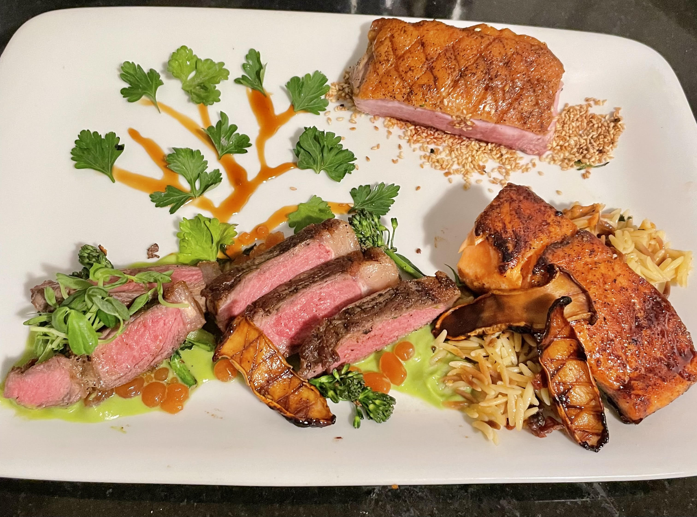
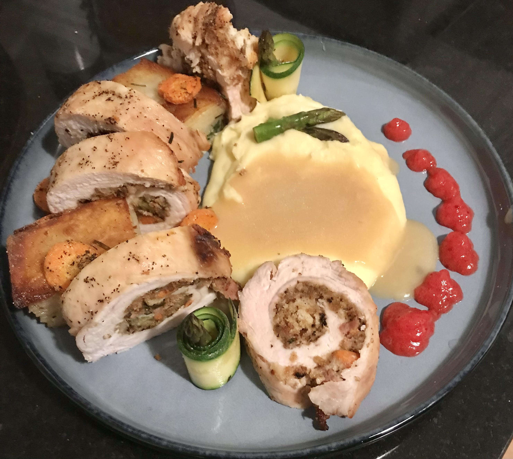
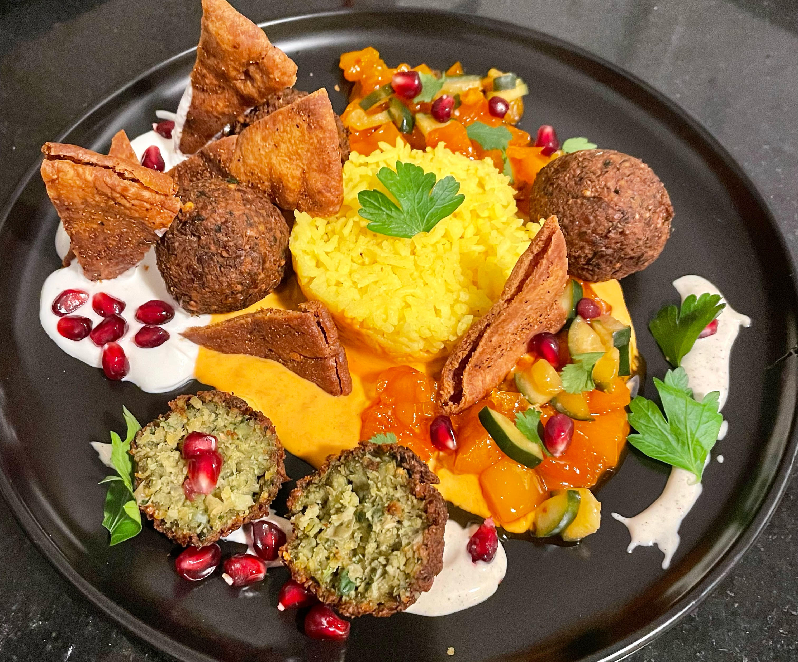

<!-- Include CSS and JS directly in the Markdown file -->

Biology
======
I am a molecular biologist studying the spatiotemporal characteristics of cells at the [Whitehead Institute](https://wi.mit.edu/) & [MIT](https://be.mit.edu/), with a focus on predicting the characteristics and consequences of interacting molecular components.

Computation
======
I develop analytical computational platforms (see the [Spateo package](https://github.com/aristoteleo/spateo-release)). I am also a hobby programmer always eager to learn more about what we can do with machines. I have recently ventured into developing atomistic protein modeling tools and language modeling (see the Portfolio page for examples!)

Hobbies
======
Here are some of the overtly non-scientific things I love to do and am always happy to talk about!

Cooking
------ 
To me, the ultimate form of artistic expression because you get to eat the art afterwards, and if you're lucky, it's as good as it looks!

	

		

			
			

				

					
"Xīnnián Kuàilè"

					

					
A celebration of the Lunar New Year. Egg fried rice, pork potstickers, sweet potato puree, radish, pea shoots, pork char siu, panda-styled red bean bun, fried sesame balls with ube jam.

				

			

		

	

	

		

			
			

				

					
"Soil, Sea and Sky"

					

					
A dish that represents each of the highest-level ecological zones: terrestrial, marine and aerial! Honey garlic salmon, orzo, sirloin steak, broccolini, pea puree, king oyster mushroom, duck, toasted sesame, tomato pearls and a teriyaki sauce & parsley tree.

				

			

		

	

	

		

			
			

				

					
"Elevated Thanksgiving"

					

					
An elevated take on Thanksgiving dinner. Turkey roulade, mashed potatoes, potato pave, cranberry gel, assorted vegetables.

				

			

		

	

	

		

			
			

				

					
"Mediterranean Medley"

					

					
A miscellaneous Mediterranean mashup! Falafel, pita crisps, tzatziki, yogurt, harissa tahini, pomegranate, mango chutney, cucumber slaw, and basmati rice.

				

			

		

	

	
	

		

			
			

				

					
"KBBQ Plate"

					

					
Galbi (Korean BBQ short rib), nasi goreng w/ fried egg, Chinese cabbage slaw with sweet & sour homemade Asian dressing.

				

			

		

	

	

		

			
			

				

					
"Deconstructed Big Mac Meal"

					

					
NY strip steak, toasted sesame buns, butter lettuce, pickle, onion, "special sauce", pommes puree, ketchup, Sprite in a wine glass (not pictured).

				

			

		

	

Baking
------ 
I love making cakes for special occasions!

Running
------ 
No better way to clear your head and relax than with constant searing lung pain! Just kidding, kind of. 
 
Magic: The Gathering
------ 
The greatest tabletop game ever created. A summary of my current EDH decks and favorite parts of the Multiverse.

Video Games
------
Currently, my top five video games of all time, in order: 

  

