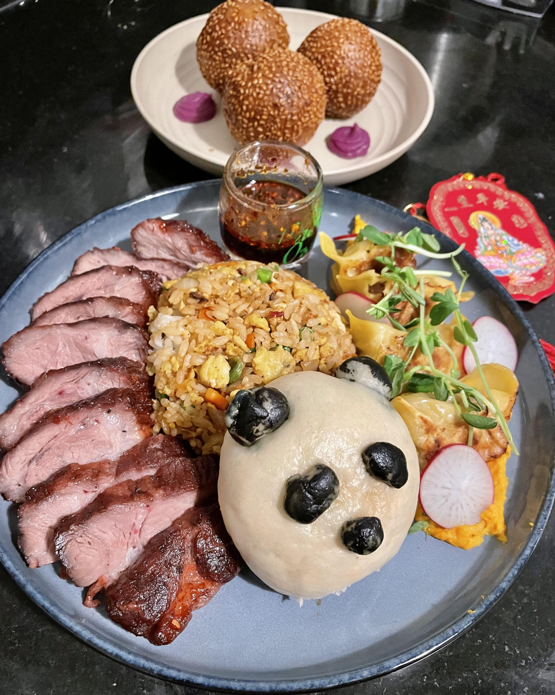

Biology
======
I am a molecular biologist studying the spatiotemporal characteristics of cells at the [Whitehead Institute](https://wi.mit.edu/) & [MIT](https://be.mit.edu/), with a focus on predicting the characteristics and consequences of interacting molecular components.

Computation
======
I develop analytical computational platforms (see the [Spateo package](https://github.com/aristoteleo/spateo-release)). I am also a hobby programmer always eager to learn more about what we can do with machines. I have recently ventured into developing atomistic protein modeling tools and language modeling (see the Portfolio page for examples!)

Hobbies
======
Here are some of the overtly non-scientific things I love to do and am always happy to talk about!

Cooking
------ 
To me, the ultimate form of artistic expression because you get to eat the art afterwards, and if you're lucky, it's as good as it looks!

```html
<div class="image-container">
  
  
</div>

Baking
------ 
I love making cakes for special occasions!

Running
------ 
No better way to clear your head and relax than with constant searing lung pain! Just kidding, kind of. 
 
Magic: The Gathering
------ 
The greatest tabletop game ever created. A summary of my current EDH decks and favorite parts of the Multiverse.

Video Games
------
Currently, my top five video games of all time, in order: 


  


