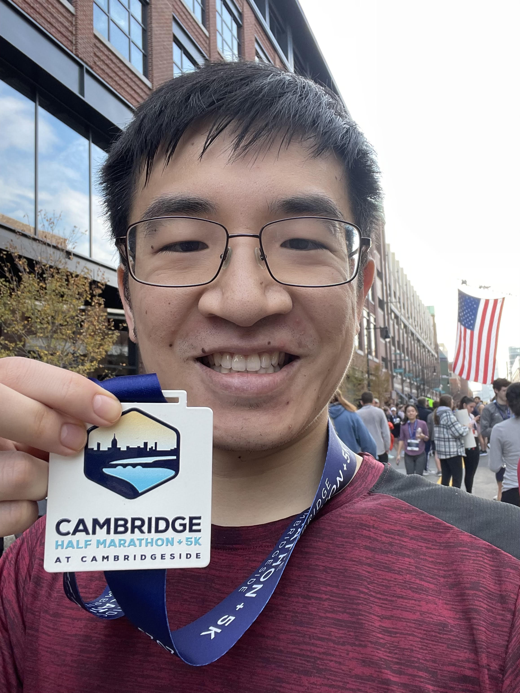
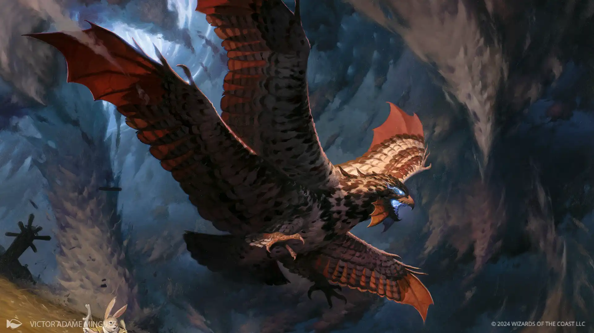
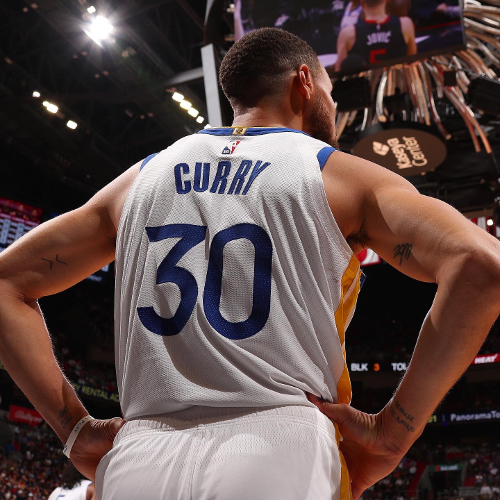



Here are some of the overtly non-scientific things I love to do and am always happy to talk about!

Cooking
======
To me, the ultimate form of artistic expression because you get to eat the art afterwards, and if you're lucky, it's as good as it looks!

	

		

			
			

				

					
"Xīnnián Kuàilè"

					

					
A celebration of the Lunar New Year. Egg fried rice, pork potstickers, sweet potato puree, radish, pea shoots, pork char siu, panda-styled red bean bun, fried sesame balls with ube jam.

				

			

		

	

	

		

			
			

				

					
"Soil, Sea and Sky"

					

					
A dish that represents each of the highest-level ecological zones: terrestrial, marine and aerial! Honey garlic salmon, orzo, sirloin steak, broccolini, pea puree, king oyster mushroom, duck, toasted sesame, tomato pearls and a teriyaki sauce & parsley tree.

				

			

		

	

	

		

			
			

				

					
"Elevated Thanksgiving"

					

					
An elevated take on Thanksgiving dinner. Turkey roulade, mashed potatoes, potato pave, cranberry gel, assorted vegetables.

				

			

		

	

	

		

			
			

				

					
"Mediterranean Medley"

					

					
A miscellaneous Mediterranean mashup! Falafel, pita crisps, tzatziki, yogurt, harissa tahini, pomegranate, mango chutney, cucumber slaw, and basmati rice.

				

			

		

	

	
	

		

			
			

				

					
"KBBQ Plate"

					

					
Galbi (Korean BBQ short rib), nasi goreng w/ fried egg, Chinese cabbage slaw with sweet & sour homemade Asian dressing.

				

			

		

	

	

		

			
			

				

					
"Deconstructed Big Mac Meal"

					

					
NY strip steak, toasted sesame buns, butter lettuce, pickle, onion, "special sauce", pommes puree, ketchup, Sprite in a wine glass (not pictured).

				

			

		

	

Baking
======
I love making cakes for special occasions- and sometimes regular occasions.

	

		

			
			

				

					
"Black Forest Cake"

					

					
A birthday cake for a friend. Chocolate sponge, cherry liqueur syrup, whipped cream, chocolate bark, pitted cherries and chocolate shavings.

				

			

		

	

	

		

			
			

				

					
"Peppermint Pizzazz"

					

					
Chocolate espresso sponge, peppermint buttercream, dark chocolate ganache, candy cane brittle and white chocolate peppermint bark.

				

			

		

	

	

		

			
			

				

					
"Hazelnut Symphony"

					

					
No special occasion unless a love of Nutella counts as a special occasion. Chocolate sponge, hazelnut & almond streusel, hazelnut mousse, dark chocolate ganache, dark chocolate & Nutella shards, pecan shavings, Ferrero Rocher.

				

			

		

	

	

		

			
			

				

					
"Oreo Domes"

					

					
Cookies & cream mousse hemispheres, Oreos (whole cookies and crumble), brownie round, vanilla mirror glaze, caramel syrup, lemon shavings, decorative Pirouette chocolate fudge wafer.

				

			

		

	

	

		

			
			

				

					
"Ode to Reese's"

					

					
Even though I stopped trick-or-treating over a decade ago, I still like to put out candy for everyone else. One year I had enough leftover peanut butter cups to make a cake- chocolate sponge, peanut buttercream, milk chocolate ganache, decorative Reese's cups.

				

			

		

	

	

		

			
			

				

					
"Yuletide on the Forest Floor"

					

					
Chocolate genoise sponge, chocolate chestnut whipped cream, dark chocolate ganache, meringue mushrooms, cranberry, decorative rosemary, sugar and simple syrup.

				

			

		

	

Running
====== 
No better way to clear your head and relax than with constant searing lung pain! Just kidding, kind of. 
I'm on <a href="https://www.strava.com/athletes/83649431">Strava!</a>

	

		

			
			

				

					
"Black Forest Cake"

					

					
My first major running milestone was the Cambridgeside half marathon, completed in 1:55:40.

				

			

		

	

 
Magic: The Gathering
====== 
The best tabletop game there is. A summary of my current EDH decks and favorite parts of the Multiverse.

	

		

			
			

				

					
Xenagos

					

					
The deck's pretty straightforward and fun. Play a bunch of big timmy creatures, give them haste and 2x their power with Xenagos, donk someone for 10+ in one turn.

				

			

		

	

	

		

			
			

				

					
"Snakes on a Plane (Xyris)"

					

					
The deck that I'm proudest of building from both a strength & fun factor- the group hug core and degenerate token-making often leads to some pretty fun games!

				

			

		

	

	

		

			
			

				

					
"Feathered Firestorm (Dragonhawk)"

					

					
My newest deck that I'm currently piloting, designed to be a thematic dragon tribal deck with treasures, burn damage and of course, dragons!

				

			

		

	

Sports
====== 
I'm an avid sports fan! I became fans of any city-based teams depending on where I was living when I developed an interest in the sport, with the obvious exception of the soccer teams. In the case of the NBA, I also definitely have players I cheer for!

	

		

			
			

				

					
NFL- American Football

					

					
Denver Broncos- at least we'll always have 2015-16 lol

				

			

		

	

	

		

			
			

				

					
NBA- Basketball

					

					
Toronto Raptors

				

			

		

	

	

		

			
			

				

					
NBA- Basketball

					

					
Also a major Curry fanboy.

				

			

		

	

	

		

			
			

				

					
NHL- Hockey

					

					
Toronto Maple Leafs

				

			

		

	

	

		

			
			

				

					
Soccer

					

					
FC Bayern Munich

				

			

		

	

	
	

		

			
			

				

					
E-Sports

					

					
OpTic Gaming

				

			

		

	

 

Video Games
======
Currently, my top five video games of all time, in order:

 
<ol>
  <li>The Elder Scrolls V: Skyrim</li>
  <li>Elden Ring</li>
  <li>Pokemon Mystery Dungeon: Explorers of Sky</li>
  <li>World of Warcraft</li>
  <li>Call of Duty: Black Ops 3</li>
</ol>

Media (not the biological kind!)- under construction
======
Some of my favorite movies (not in order, this is too hard):
* Interstellar
* Ratatouille (unironically inspired me to learn to cook!)
* The Dark Knight
* Good Will Hunting
* There Will Be Blood
* The Social Network
* Pirates of the Caribbean: The Curse of the Black Pearl
* La La Land

Shows:
* Jeopardy!
* Succession
* Full Metal Alchemist: Brotherhood
* Your Lie in April
* Shark Tank

Books (and Manga):
* The Great Gatsby
* [All the Light We Cannot See](https://www.goodreads.com/book/show/18143977-all-the-light-we-cannot-see?from_search=true&from_srp=true&qid=iwxz6E4gij&rank=1)
* [Americanah](https://www.goodreads.com/book/show/15796700-americanah?from_search=true&from_srp=true&qid=qqW9dzOsfe&rank=1)
* [American Gods](https://www.goodreads.com/book/show/30165203-american-gods)
* A Song of Ice and Fire series
* One Piece

Music:
* Panic! At the Disco
* The Band CAMINO
* AJR
* Hozier
* Benson Boone
* Zach Bryan
* NF
